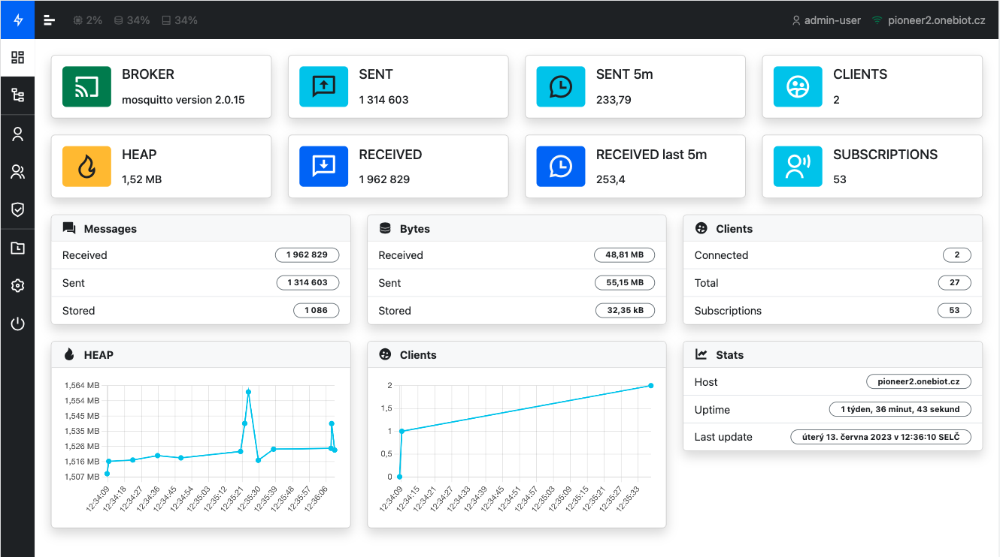

> It's not done yet

# Pioneer 3

#### A Vue.js WebSocket client to explore `$SYS/#` topics.


See it in action at https://pioneer3.onebiot.cz/#/

[](#)

## Features
- it's online
- you don't need setup anything, just connect
- primary compatible with Mosquitto brokers
- it is Single Page Application (SPA) client, I do not save any data about you or your connections

## Cons
- you can connect only to broker supporting websockets
- no connection manager (for storing credentials and hosts use
 or )

## Usage

### online
You can try everything online without any installation at https://pioneer3.onebiot.cz/#/. Client has predefined connection
to test.mosquitto.org public broker to see a basic functions. 

### locally
Clone repository from **github**:

```shell
git clone https://github.com/1biot/pioneer-3.git
```

Install dependencies and build client:

```shell
cd pioneer-3
npm install
npm run build
```

Run locally:

```shell
npm run preview
```

at your browser: http://localhost:5174/#/

or use docker:

```shell
npm run docker:dist
```

at your browser: http://localhost:9000/#/

## Documentation
Read [the documentation ](https://github.com/1biot/pioneer-3/blob/master/docs/README.md)
in order to learn more about the project.

## Contribute
I am open to new ideas how to improve this client. If you want you can

- fork this repository
- create a new branch at your fork
- implement new feature or bugfix (`npm run dev` for development at http://localhost:5174/#/)
- create a pull request

[](http://standardjs.com)
